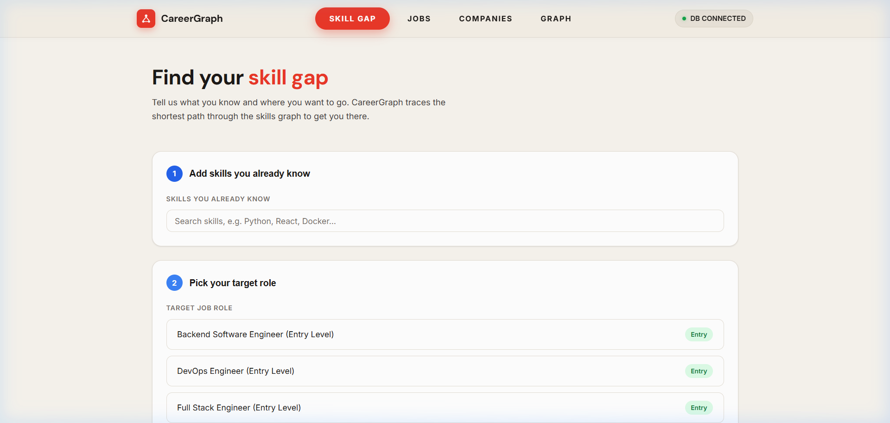
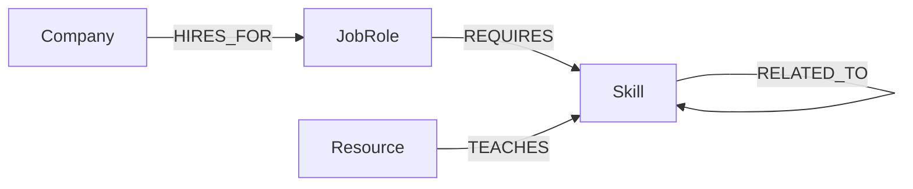

# CareerGraph

> A graph-database-powered career skill navigator & talent-market analyzer — built on **CognoDB** (openCypher / Bolt protocol).



---

## Use Case & Problem Statement

In modern software engineering, career development is non-linear. Skills depend on each other (prerequisites), jobs require diverse skill combinations with different priority levels, companies compete for overlapping talent pools, and learning resources teach specific skills.

**CareerGraph** models these complex real-world connections as a graph:
- **Find your skill gap path**: Traces the shortest multi-hop learning route from skills you already know to skills required by your dream job role.
- **Discover adjacent skill recommendations**: Recommends co-occurring skills based on job market demands.
- **Analyze talent-market competitors**: Identifies companies competing for candidates with similar skill requirements.
- **Access curated learning resources**: Links missing skills directly to interactive courses and documentation.

---

## Why a Graph Database?

Relational databases store data in static tables. Querying multi-hop skill paths or co-occurrence relationships in SQL requires:
- Painful junction tables (`skill_prerequisites`, `job_skill_weights`, `company_jobs`, `resource_skills`).
- Recursive Common Table Expressions (CTEs) that are slow, complex, and prone to performance bottlenecks as dataset depth increases.

With **CognoDB** (backed by openCypher and Bolt protocol):
1. **Shortest-Path Traversal (`shortestPath`)**: Finding the multi-hop learning path from known skills to target job requirements is a single openCypher pattern match rather than recursive joins.
2. **Graph-Native Collaborative Filtering**: Recommending adjacent skills co-occurring across job roles (`Skill <- REQUIRES - JobRole - REQUIRES -> Skill`) is a simple 2-hop pattern traversal.
3. **Talent-Market Overlap**: Discovering competitors with shared skill requirements is a 3-hop graph query executed natively in memory.

---

## Data Model



### Node Labels & Properties

| Label      | Key Properties                         | Description                                      |
|------------|----------------------------------------|--------------------------------------------------|
| `Skill`    | `id`, `name`, `category`              | Individual technical skill or domain concept     |
| `JobRole`  | `id`, `title`, `level`                | Target career role (Entry, Mid, Senior)          |
| `Company`  | `id`, `name`, `industry`              | Organization hiring for job roles                |
| `Resource` | `id`, `name`, `type`, `url`           | Course, doc, or tutorial teaching a skill        |

### Relationship Types

| Relationship  | From       | To        | Properties      | Description                                       |
|---------------|------------|-----------|-----------------|---------------------------------------------------|
| `RELATED_TO`  | `Skill`    | `Skill`   | _(undirected)_  | Prerequisite or complementary skill connection     |
| `REQUIRES`    | `JobRole`  | `Skill`   | `weight` (0–1)  | Skill required for a role + priority weight       |
| `HIRES_FOR`   | `Company`  | `JobRole` | –               | Company hiring for a specific role                |
| `TEACHES`     | `Resource` | `Skill`   | –               | Resource teaching a target skill                  |

---

## Main Cypher Queries Explained

All Cypher queries in `backend/app/queries.py` are **fully parameterized** via the official Neo4j Python driver. No string concatenation is used.

### 1. Skill-Gap Path (Multi-hop Traversal — 2 to 4 Hops)
Finds the shortest `RELATED_TO` path from any skill the user already knows to each missing skill required by the target job.

```cypher
MATCH (j:JobRole {id: $target_job_id})-[:REQUIRES]->(missing:Skill)
WHERE NOT missing.id IN $known_skill_ids
MATCH (known:Skill) WHERE known.id IN $known_skill_ids
MATCH p = shortestPath((known)-[:RELATED_TO*1..4]-(missing))
WITH missing, p, length(p) AS hops
ORDER BY hops ASC
WITH missing, collect(p)[0] AS best_path, min(hops) AS shortest_hops
RETURN missing.name AS missing_skill,
       shortest_hops AS hops,
       [n IN nodes(best_path) | n.name] AS path
ORDER BY shortest_hops ASC
```

### 2. Skill Recommendations (Relational-Awkward Graph Pattern)
Discovers skills that co-occur most frequently across job postings. In SQL this requires costly multi-table self-joins; in openCypher it is a clean 2-hop pattern.

```cypher
MATCH (s:Skill {id: $skill_id})<-[:REQUIRES]-(j:JobRole)-[:REQUIRES]->(other:Skill)
WHERE other.id <> $skill_id
RETURN other.id AS id, other.name AS name, count(DISTINCT j) AS shared_jobs
ORDER BY shared_jobs DESC
LIMIT $limit
```

### 3. Talent-Market Competitor Discovery
Finds companies whose job roles demand overlapping skill sets — identifying talent competitors.

```cypher
MATCH (c1:Company {id: $company_id})-[:HIRES_FOR]->(:JobRole)-[:REQUIRES]->(s:Skill)
      <-[:REQUIRES]-(:JobRole)<-[:HIRES_FOR]-(c2:Company)
WHERE c1 <> c2
RETURN c2.id AS id, c2.name AS name, count(DISTINCT s) AS shared_skills
ORDER BY shared_skills DESC
LIMIT $limit
```

---

## Setup & Local Run Instructions

### Prerequisites
- Python 3.11+
- Node.js 18+
- A free **CognoDB Cloud** account

### 1. Create a CognoDB Instance
1. Sign up at [console.cognodb.com/signup](https://console.cognodb.com/signup).
2. Click **Create Instance** -> select the free **c0** tier and pick a region.
3. Save your connection details:
   - `NEO4J_URI`: `bolt+s://<instance-id>.databases.cognodb.cloud`
   - `NEO4J_USER`: `cognodb`
   - `NEO4J_PASSWORD`: `<your-generated-password>`

### 2. Environment Configuration
Copy `.env.example` to `.env` in both `backend` and `frontend` directories:

```bash
# Backend configuration
cp backend/.env.example backend/.env
```

Edit `backend/.env`:
```env
NEO4J_URI=bolt+s://<your-instance-id>.databases.cognodb.cloud
NEO4J_USER=cognodb
NEO4J_PASSWORD=<your-generated-password>
```

```bash
# Frontend configuration
cp frontend/.env.example frontend/.env
```

### 3. Seed the Database
Run the idempotent seed script to create uniqueness constraints, 25 skills, 7 job roles, 5 companies, and 5 learning resources:

```bash
cd backend
pip install -r requirements.txt
python -m seed.seed
```

### 4. Start Backend Server
```bash
cd backend
uvicorn app.main:app --reload
# API available at http://localhost:8000
# OpenAPI Docs at http://localhost:8000/docs
```

### 5. Start Frontend Application
```bash
cd frontend
npm install
npm run dev
# App available at http://localhost:5173
```

---

## Project Architecture & Structure

```
careergraph-scaffold/
├── backend/
│   ├── app/
│   │   ├── main.py        # FastAPI endpoints, CORS, request validation
│   │   ├── queries.py     # Parameterized openCypher queries
│   │   ├── db.py          # Neo4j driver context manager & error handling
│   │   └── config.py      # Environment variable loader
│   ├── seed/
│   │   ├── seed.py        # Idempotent database seeder (MERGE syntax)
│   │   └── data.py        # Realistic graph dataset definitions
│   └── requirements.txt
├── frontend/
│   ├── src/
│   │   ├── pages/
│   │   │   ├── Home.tsx          # Skill-Gap path finder
│   │   │   ├── JobsPage.tsx      # Job roles browser & requirements
│   │   │   ├── CompaniesPage.tsx # Companies & talent competitor analysis
│   │   │   └── GraphPage.tsx     # Interactive force-directed graph visualizer
│   │   ├── components/
│   │   │   ├── Header.tsx        # Warm aesthetic navigation bar & DB status pill
│   │   │   ├── SkillSearch.tsx   # Skill autocomplete picker
│   │   │   ├── JobPicker.tsx     # Job selection cards
│   │   │   ├── PathResult.tsx    # Visual skill-gap route display
│   │   │   ├── GraphCanvas.tsx   # 2D force graph canvas
│   │   │   ├── RecommendPanel.tsx# Skill recommendation panel
│   │   │   └── SkillChip.tsx     # Categorized skill badges
│   │   ├── index.css             # Warm aesthetic design system & tokens
│   │   └── api.ts                # Axios API client
│   └── package.json
└── README.md
```

---

## Submission Details

- **Deliverable**: GitHub Repository URL + CognoDB Cloud Database Instance
- **Email Submission**: `hr@wexa.ai`
- **Subject Line**: `CognoDB Assignment 2 – <Your Name>`
- **Database Note**: The CognoDB Cloud database instance remains active for evaluator testing.
